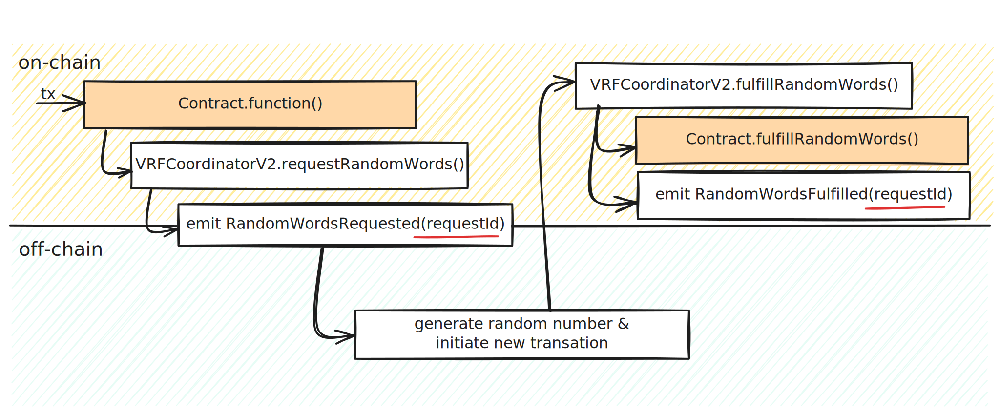

# Chainlink VRF (Verifiable Random Function)

The process of generating a verifiable random number using Chainlink VRF involves two primary steps. In the initial step, the requesting smart contract (`Contract`) invokes the `requestRandomWords()` function, which sends a request for random number generation to the Chainlink oracle network. Once the randomness is computed off-chain, Chainlink responds by executing the callback function `Contract.fulfillRandomWords()`, supplying the generated random words. In that moment, logical exeution initiated with request can continue.

During this process, various events are emitted by the Chainlink VRF Coordinator, including the `requestId`, which serves as a unique identifier. This `requestId` allows the linking of the request and the subsequent fulfillment.

#### What is the logic behind Dune query below




Let's call the first step as `request` and second step (fullfilment) we can call `response`. 
First we need to match request and response logs that have the same `requestId`. It is indexed log in response, but not in request, so we need to extract it from request.data 
```
FROM ethereum.logs as request 
JOIN ethereum.logs as response 
ON substr(request.data,1,32) = response.topic1
```

Then we need to find specific request logs that correspond to signature `RandomWordsRequested(bytes32,uint256,uint256,uint64,uint16,uint32,uint32,address)`. 

Finally, we can return URLs of tenderly and etherscan explorer to actually see the transaction details.

```sql
SELECT 
request.block_number as request_bn,
response.block_number as response_bn,
concat('https://dashboard.tenderly.co/tx/mainnet/0x', to_hex(request.tx_hash)) as request_tenderly, 
concat('https://dashboard.tenderly.co/tx/mainnet/0x', to_hex(response.tx_hash)) as response_tenderly,
concat('https://etherscan.io/tx/0x', to_hex(request.tx_hash)) as request_etherscan,
concat('https://etherscan.io/tx/0x', to_hex(response.tx_hash)) as response_etherscan
FROM ethereum.logs as request 
JOIN ethereum.logs as response 
ON substr(request.data,1,32) = response.topic1
WHERE 
request.block_time > now() - interval '10' day and
response.block_time > now() - interval '10' day and
request.topic0 = keccak(to_utf8('RandomWordsRequested(bytes32,uint256,uint256,uint64,uint16,uint32,uint32,address)'))
ORDER BY request.block_time DESC
```

Connected Dune analytics dashboard is on the following link.
https://dune.com/stuparm/chainlink-vrf-transactions